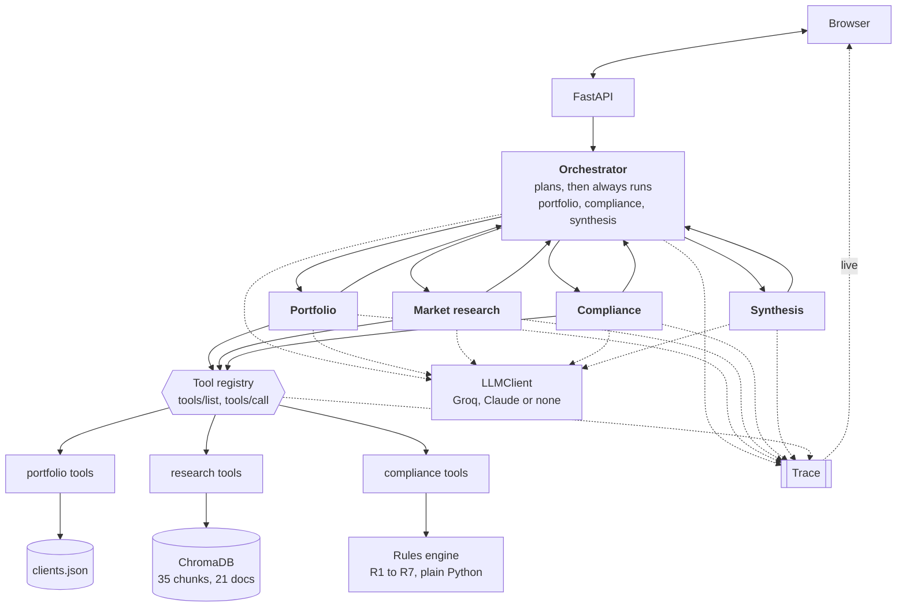

# Aegis

[](https://github.com/nishantrv333/Aegis-Advisory-Assistant/actions/workflows/eval.yml)

An adviser at a private bank asks for a briefing before a client meeting. Five
agents work out what to do, pull up the client's holdings, search a research
library, run a set of suitability checks, and write the briefing. Every step
they take is printed to a trace you can read.

**[See it running](https://nishantrv333.github.io/Aegis-Advisory-Assistant/)**

All the data is made up. Every client, fund, price and research document is
generated by scripts in this repo. There is no real client information here.

I built this to show how I would approach GenAI in an industry where someone
has to justify the output afterwards.

---

## Why I built it this way

The interesting problem in wealth advice is not making a language model write
something. It is making the output defensible. If a compliance officer asks why
the system flagged a recommendation, "the model decided" is not an answer.

So the project is organised around one idea: the parts that must be auditable
are ordinary code, and the model only does the parts where being wrong is
survivable.

That shows up in a few places.

### The rules engine decides, the model explains

The suitability checks are plain Python. No model is involved in deciding
whether something gets flagged. The model writes the note the adviser reads,
and then the agent puts the engine's result back over the top of whatever the
model said.

I did it this way because a model is good at summarising and bad at auditing.
You cannot reproduce its judgement, compare it between versions, or point a
reviewer at the line that caused a flag. With a rules engine, the answer to
"why was this flagged" is a rule number and a line of code.

### The orchestrator plans, but it cannot skip the compliance check

The model picks which research questions to ask and which funds to check. That
is real freedom and it makes the system useful. But the portfolio lookup, the
compliance check and the final write up are added to every run automatically,
whatever the model says.

A system where the model could quietly leave the suitability check out of its
plan is not something a bank could use. I also validate any fund the model
names against the actual product list before it reaches the rules engine, so a
made up ticker gets dropped and logged instead of checked.

### Citations are decided before the model writes

Every passage the search returns gets a label (S1, S2 and so on) before the
model is called. The model can only cite those labels, and anything it invents
gets stripped out and recorded in the trace. So a citation in the briefing
always points at a passage that was really retrieved.

### The fallback path is a path I actually use

Every agent has a non model version of what it does. That is not error handling
I wrote and forgot about. It is what runs in the tests and what you get if you
clone this without an API key. Because it runs constantly, it stays correct.

It also means you can try this project in about two minutes without signing up
for anything.

### One thing the tests caught that I would not have

I search the research library with several questions at once and combine the
results. My first version pooled all the hits and sorted them by similarity
score. The tests showed that adding more questions made the results worse,
which was the opposite of what I expected.

The reason is that scores from different questions are not comparable. A broad
question like "multi asset outlook" returns vaguely related passages scoring
0.25, while a specific one like "the client is asking about the Solaris AI
fund" returns exactly the right passage scoring 0.18, because all the ordinary
words around it dilute the match. Sorting them together threw away the good
answer.

The fix was to combine by position instead of by score, using reciprocal rank
fusion. A passage that came first for any question beats one that came third
for several. That took retrieval from 70% to 80%. Then I fed the fund names the
orchestrator had already worked out back into the search, so it asks a clean
question about the actual fund instead of hoping the adviser's wording works.
That took it to 90%.

I would not have found this by reading the code. It is the main reason I think
the test suite was worth the time.

---

## Try it

```bash
git clone https://github.com/nishantrv333/Aegis-Advisory-Assistant.git
cd Aegis-Advisory-Assistant

python -m venv .venv && source .venv/bin/activate   # Windows: .venv\Scripts\activate
pip install -r requirements.txt

python data/generate_data.py      # 8 made up clients, 11 made up funds
python data/generate_corpus.py    # 21 made up research documents

uvicorn main:app --reload
```

Open <http://127.0.0.1:8000> and pick one of the example questions.

No API key needed. Without one, every agent uses its non model path and you
still get a full briefing with working search, rules and tracing. The prose is
plainer, and the status bar at the top of the page tells you which mode you are
in. Copy `.env.example` to `.env` and add a free Groq key if you want the model
written version.

To run the tests:

```bash
python eval/run_eval.py                    # everything
python eval/run_eval.py --retrieval-only   # just the search, no agents
python eval/check_compliance.py            # just the rules, this one blocks CI
```

---

## How it fits together



A real run looks like this:

```
POST /api/briefing {"client_id": "4526", "query": "Client wants 150k in Bramble private credit"}

  orchestrator plans          picks the research questions and the fund to check (BPC)
  portfolio                   always runs first
    get_client_profile        Balanced, Retail, 2 year horizon, needs access to cash
    get_holdings              1.24m across 5 positions
  market research             the only optional step
    search x 4                four questions, results combined by rank
    summarise                 cites S1 to S8, invented citations removed
  compliance                  always runs, the plan cannot skip it
    check_suitability         FAIL, 4 flags: R1, R2, R3, R4
    explain                   writes the note, cannot change the result
  synthesis                   always runs last
    write_briefing            prose only, numbers and flags passed through untouched

  briefing JSON plus a 28 step trace
```

### The agents talk through messages, not method calls

No agent imports another one. They send typed messages through a router, which
is what makes this genuinely multi agent rather than one class calling
another's methods. Swapping the in process router for HTTP or a queue would be
a change to one file.

### The tools follow the MCP shape

Each tool publishes a JSON Schema for its inputs, gets called as
`(name, arguments)`, returns content with an error flag rather than raising,
and has its arguments checked before the handler runs.

To show this is not just MCP flavoured naming, the same handlers are served
over real JSON-RPC:

```bash
echo '{"jsonrpc":"2.0","id":1,"method":"tools/list"}' | python -m mcp_layer.stdio_server portfolio
```

Point any MCP client at that command and the tools show up.

### Swapping the model provider

Agents talk to an `LLMClient` interface, never to a vendor SDK. All the retry
and JSON repair logic sits in the base class, so each provider is about twenty
lines. Groq is the default because it is free and fast enough that changing a
prompt costs nothing. The Claude version is written and ready. Switching is one
line in `.env`.

---

## Folder layout

```
main.py                    the API and the live trace stream
config.py                  settings, all from environment variables
core/
  trace.py                 records every step
  a2a.py                   the messages agents send each other
llm/
  base.py                  the interface every provider implements
  providers.py             Groq, Claude, and the no key version
mcp_layer/
  protocol.py              tool descriptions and schema checking
  registry.py              in process tool calls
  stdio_server.py          the same tools over JSON-RPC
tools/
  portfolio_server.py      client data
  research_server.py       search
  compliance_server.py     the rules, R1 to R7
agents/
  orchestrator.py          planning, and the parts it cannot skip
  portfolio_agent.py
  market_research_agent.py
  compliance_agent.py
  synthesis_agent.py
rag/store.py               chunking, embeddings, ChromaDB
data/                      the generators and their output
static/                    the web page
demo/build_demo.py         records real runs for the GitHub Pages demo
eval/                      the test suite
```

---

## Testing

Ten cases run the whole pipeline and check five things: the right document was
found and cited, the compliance result is correct, the intended rules fired, no
unintended rules fired, and every citation in the text points at a real source.

I worked out the expected answers from the rules themselves rather than
recording what the system already did. A test suite built from your own output
only proves the system is consistent, not that it is right.

| Check | Result |
|---|---|
| found the right document | 9 of 10 |
| compliance result correct | 10 of 10 |
| intended rules fired | 10 of 10 |
| no unintended rules fired | 10 of 10 |
| citations all resolve | 10 of 10 |

One case fails and I left it failing. The question "review concentration risk
in the AI and automation theme" should bring up the AI spending commentary, and
it does not. I think that is a limit of the offline search model, which matches
on words, so "AI and automation theme" and "hyperscaler capital expenditure"
share almost nothing even though they are about the same thing. A better
embedding model should connect them, but I could not verify that where I built
this, so it stays an open item rather than a claim. Tuning the test until it
went green would have made the whole suite worthless.

CI treats the two kinds of test differently on purpose. Search quality is
reported but does not block the build, because a build that is permanently red
teaches everyone to ignore it. The compliance check does block, and checks the
rules exactly. A rules engine that quietly changes its mind between commits is
the one thing this project cannot ship.

Each made up client exists to trigger one specific rule, which is what makes
the expected answers real rather than circular:

| Client | What it tests | Result |
|---|---|---|
| 4521 | high risk fund for a cautious client (R1) | fail |
| 4522 | one position too large (R2) | review |
| 4523 | breaks the client's exclusion list (R5) | fail |
| 4524 | paperwork out of date (R6) | fail |
| 4525 | fund not registered in their country (R7) | fail |
| 4526 | hard to sell fund, client needs access to cash (R3) | fail |
| 4527 | complex product for a retail client (R4) | fail |
| 4528 | nothing wrong | pass |

The last one matters as much as the rest. An engine that flags everything is as
useless as one that flags nothing.

---

## The suitability rules

Seven rules I made up for this project. They are not from the FCA Handbook or
anyone's real policy.

| Rule | What it checks | Severity |
|---|---|---|
| R1 | fund risk level against what the client's profile allows | high |
| R2 | any single risk position over 25% of the portfolio | medium |
| R3 | funds you cannot sell daily, for clients who need access to cash | high |
| R4 | leveraged or complex products for retail clients | high |
| R5 | sectors the client has asked to avoid | high |
| R6 | suitability review older than twelve months | high |
| R7 | fund not registered where the client lives | high |

Any high severity flag means fail. Medium only means review. Nothing means pass.

R2 skips cash and government bonds on purpose. Without that, every cautious
portfolio gets flagged for holding a large, deliberately boring bond position,
and a rule that fires on correct behaviour trains people to ignore it.

---

## The API

| Method | Path | What it does |
|---|---|---|
| POST | `/api/briefing` | the briefing and the full trace |
| GET | `/api/briefing/stream` | the trace as it happens |
| GET | `/api/clients` | the made up client list |
| GET | `/api/agents` | what each agent can do |
| GET | `/api/tools` | the tool descriptions |
| GET | `/api/rules` | the suitability rules |
| GET | `/api/health` | provider, search model, index size |

```bash
curl -X POST localhost:8000/api/briefing \
  -H 'content-type: application/json' \
  -d '{"client_id":"4526","query":"Client wants 150k in Bramble private credit"}'
```

Interactive docs at `/docs`.

---

## The demo page

The demo link at the top has no backend behind it. GitHub Pages only serves
files, so `demo/build_demo.py` runs the real pipeline locally, saves what
actually happened, and the page plays those recordings back.

The traces, briefings, flags and citations are real output from real runs. Only
the playback speed is made up, because a run finishes in about ten milliseconds
and would otherwise appear instantly. The status bar says "recorded run" so
nobody is misled.

```bash
python demo/build_demo.py
python -m http.server -d docs 8080   # preview at localhost:8080
```

If you change the agents, record it again or the demo will drift away from the
code.

There is also a `Dockerfile` if you want a live version someone can type their
own questions into. It needs no API key, so it deploys to Hugging Face Spaces,
Render or Railway without any secrets.

---

## What I would fix before this went near production

I would rather list these than have someone find them.

There is no login, no permissions and no rate limiting. Anyone who can reach
the API can read every client. That has to come first.

The briefing is a draft for a qualified adviser to check, never something to
put in front of a client. The compliance flags are the part I trust, because
they are deterministic. The prose is the part I trust least.

I do not defend against instructions hidden inside the research documents. The
library is safe here because I generated it. A library containing documents
from clients or outside sources would need input checking.

Traces are kept in memory for the length of a request and then thrown away.
Anything auditable needs them stored properly, with a retention policy. The
design assumes that will happen but does not do it.

Search sits at 90% on my test set, and my test set is ten cases I wrote myself.
A real system needs a much larger set, ideally with advisers marking which
documents are actually relevant rather than me deciding.

The tests run without a real model by default so they are repeatable. That
deliberately does not test how the system behaves when the model has a bad day,
or when a model version changes. That needs a different kind of test, run
against the real provider, with a person reading the output.

---

## About the data

Every client, name, holding, valuation, fund, price and research document here
was made up by `data/generate_data.py` and `data/generate_corpus.py`. Client
names are invented and marked SYNTHETIC in the data itself. There is no real
client information and no real market data anywhere in this project.

The funds do not exist. Aurora, Helvetia, Meridian, Castellan, Northwind,
Solaris, Zephyr, Bramble and Lyra are inventions, and their risk ratings, fees
and performance figures are made up.

The compliance rules are illustrative. Nothing this system produces is
investment advice or a recommendation.
